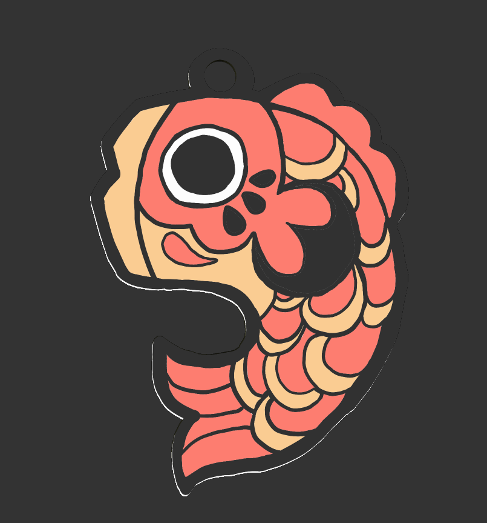
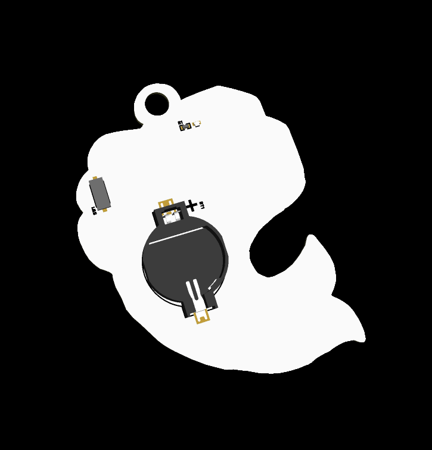
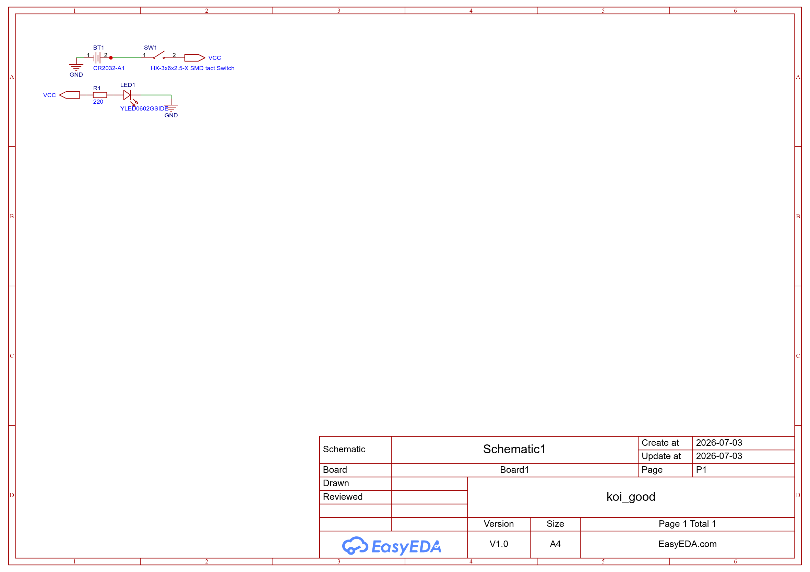

# Koichain

It's a Koichain! A koi keychain.. get it? It can light up its eyes! (or, well, just one eye visible)

Made for Fallout 2026, day 1st: a badge

## Why?

You can lure Soup with this Koi!

## Background

Uhm I really like the design of Koi, so I redrawn it on Krita with keychain aesthetics!

## How to Use

Uh, use it like a keychain.

## How it Works

A coin cell battery powers an LED. It's that simple. Also there is copper fill at the front layer that prevents the LED from diffusing in some areas.

## Build Instruction

1. Print the PCB
2. Solder the components, if not using PCBA
3. Get a coin cell battery
4. Done

## BoM

See [bom.csv](./bom.csv).
